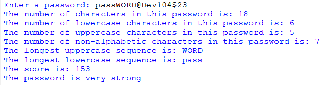

## Description:
This program designed to assess the strength of user-inputted passwords by analyzing various factors. The program calculates a score and provides a qualitative assessment, indicating whether a password is "very weak", "weak", "strong", or "very strong".  
The final password score is calculated by subtracting the penalty from the bonus.  
*Bonus:*
- The total number of characters in the password multiplied by 4
- ( The total number of characters - the total number of uppercase characters ) multiplied by 2.
- ( The total number of characters - the total number of lowercase characters ) multiplied by 3.
- The total number of non-alphabetic characters multiplied by 5.  

*Penalty:*
- The length of the longest sequence of lowercase letters multiplied by 2.
- The length of the longest sequence of uppercase letters multiplied by 2.

## Example:

